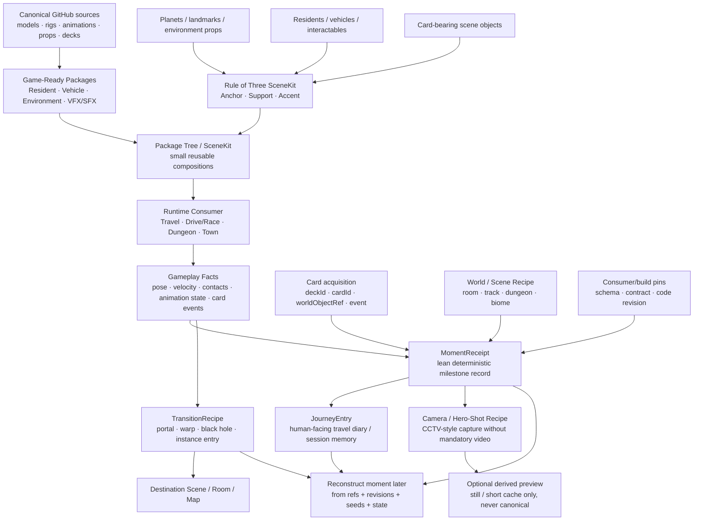

# Game Development Studio · KFB Game-Ready Packaging · Living Architecture

**Date:** 2026-09-18  
**Status:** LIVING DOCUMENT · PILOT LOCKED · BACKLOG / ARCHITECTURE ADDITIVE  
**Companion contract:** [GAME_DEV_STUDIO_ASSET_PACKAGING.md](GAME_DEV_STUDIO_ASSET_PACKAGING.md)  
**Purpose:** keep the current Lorekeeper + Sedan packaging proof small while defining the reusable architecture for reconstructible transitions, cinematics, journey memory and hierarchical scene packages.

---

## 0 · Governing rules

1. **Canonical source stays canonical.** Existing KFB/KayKit/Kenney assets remain exact GitHub refs; packaging adds derived data without duplicating ownership.
2. **Recipe first, binary only when useful.** Camera moves, hero shots, portals, warp/loading sequences and journey moments should default to small deterministic recipes rather than heavy prerecorded videos.
3. **Runtime owners remain runtime owners.** Travel owns world/mode/persistence; Race/Drive owns vehicle facts; Animation owns animation facts; audio/VFX remain presentation consumers. A package references those facts but does not create parallel engines.
4. **Lean memory stores references + minimal state, not full scene dumps.** Reconstruct from pinned packages, world recipes, seeds, state vectors and event receipts.
5. **Exact replay and semantic rebuild are different claims.** Exact reconstruction requires pinned code/build + source/data + deterministic inputs/state. Rebuilding the same scene in a newer consumer is useful but must be labelled semantic reconstruction.
6. **Pilot 01 remains unchanged.** Lorekeeper + Tome + Staff + car-sedan + minimal event package stay the capability proof. Everything below is backlog/architecture until that package passes its own gates.

---

## 1 · Commented architecture graphic



### Reading the diagram

- **Left side = reusable source/package hierarchy.**
- **Middle = live game context and real gameplay facts.**
- **Right side = reconstructible experience artifacts.**
- A cinematic moment is therefore not a detached movie; it is a **recipe over the same world, packages and state that produced the gameplay moment**.
- A Journey Entry is not the save-game owner; it references the relevant persistence/checkpoint plus a compact moment receipt.

---

## 2 · Package tree / hierarchical composition

A reusable hierarchy should be able to compose without copying child assets:

```text
SourceAssetRef
  → GameAssetPackage
    → SceneKit
      → Room / Encounter Package
        → WorldRegion / Track / Dungeon
          → TransitionRecipe / MomentReceipt
            → JourneyEntry
```

Each node should carry:

- stable ID;
- schema/version;
- exact child refs + revisions;
- optional consumer contract;
- deterministic seed where procedural layout exists;
- explicit CREATED vs REFERENCED vs PROPOSED status.

Parents reference children; they do not absorb or rename canonical child sources.

---

## 3 · Reconstructible cinematic / camera package

### 3.1 CameraRecipe

Use for:

- CCTV-style milestone captures;
- tracking shots;
- fly-bys;
- podium / victory hero shots;
- reveal shots;
- dungeon-entry shots;
- transition cameras;
- loading-cover scenes.

Minimum fields:

```text
cameraRecipeId
schema/version
consumerBuildRef
worldRecipeRef
sceneKitRefs[]
triggerEventRef
targetRefs[]
cameraRig / lens preset
start transform
path / spline / procedural move
lookAt policy
duration
animation-state refs
lighting/presentation preset refs
rngSeed
optional capturedFrameTick
```

The canonical artifact is the recipe. An image or short rendered preview may be cached for UI speed, but it is derived and disposable.

### 3.2 HeroShotRecipe

A specialization of CameraRecipe:

```text
subject:
  actor / vehicle / resident package ref
presentation:
  animation clip + normalized time
  podium / scene-kit ref
  optional card refs visible in scene
camera:
  hero rig / path / lens
context:
  track / room / world ref
  milestone / result event
```

Example uses:

- winner on a podium;
- resident reveal;
- newly unlocked vehicle;
- collected-card milestone;
- boss/room completion;
- arrival on a new planet/region.

---

## 4 · TransitionRecipe

A transition is treated as a reusable game-ready package, not as a hardcoded one-off cutscene.

Possible transition classes:

- hole / floor-drop;
- black-hole fall;
- portal;
- warp;
- hyperspace;
- tunnel/shaft;
- tower/interior entry;
- dungeon entrance;
- race-to-map transition;
- map-room / instance handoff;
- loading-cover camera move.

Minimum contract:

```text
transitionId
transitionClass
sourceWorldRef
sourceAnchor
destinationWorldRef
destinationAnchor
trigger conditions

handoff:
  actorRef
  vehicleRef
  transform
  heading
  velocity policy
  animation state
  gameplay mode
  inventory/progression references
  collected-card references
  active mission/session refs

presentation:
  cameraRecipeRef
  VFX package refs
  SFX package refs
  loading-cover policy

resume:
  spawn policy
  camera handback
  input handback
  physics handback
  persistence/checkpoint ref
```

### Important boundary

The transition may **read** velocity, collision, jump, portal and vehicle state from the gameplay owner. It must not become a second movement solver.

---

## 5 · MomentReceipt · Lean Memory core

The MomentReceipt is the compact machine-readable record that makes a session milestone reconstructible.

Suggested fields:

```text
momentId
sessionId
recordedAt / simulationTick
eventType
consumerBuildRef
consumerContractRef

world:
  worldRecipeRef
  region / room / track ref
  anchor / local frame
  worldSeed

packages:
  resident refs
  vehicle refs
  sceneKit refs
  environment refs

state:
  actor transform
  vehicle transform
  minimum required velocity/contact state
  animation clip + normalized time
  presentation/deformer state only where needed
  deterministic RNG seeds

cards:
  deckId
  cardId
  cardInstance/worldObjectRef
  acquisition event
  scene-surface / prop context

camera:
  cameraRecipeRef
  capturedFrameTick

transition:
  transitionRecipeRef if applicable

persistence:
  authoritative save/checkpoint ref
```

### Lean rule

Do **not** serialize an entire Three.js scene graph just because it is easy.

Store only what cannot be recovered from:

- pinned source assets;
- package refs;
- world/room recipe;
- consumer/build revision;
- deterministic seed;
- authoritative save/checkpoint.

---

## 6 · Exact replay vs semantic reconstruction

### EXACT_REPLAY

May be claimed only when the receipt pins enough of the historical environment:

- code/build revision;
- world/scene recipe revision;
- package revisions;
- animation/VFX/SFX contract revisions where relevant;
- deterministic seeds;
- minimal dynamic state/tick;
- required source files remain available.

### SEMANTIC_REBUILD

Uses the same logical scene/card/event/package references in a newer consumer.

It can reconstruct:

- location;
- actor/vehicle identity;
- acquired cards;
- approximate pose/event;
- transition type;
- hero-shot composition;

but must not claim frame-identical historical replay.

This distinction lets contracts evolve without pretending newer physics/rendering will reproduce an old frame exactly.

---

## 7 · JourneyEntry · personal travel diary

JourneyEntry is the human-facing layer over one or more MomentReceipts.

It may contain:

- title / milestone label;
- location/room/track;
- session ordering;
- collected KFB deck cards;
- resident/vehicle encountered;
- transition used;
- short player-facing summary;
- MomentReceipt refs;
- authoritative save/checkpoint ref;
- optional preview image ref;
- optional HeroShotRecipe ref.

A travel diary can therefore show:

```text
Session
  → Region
    → Room / Track / Dungeon
      → Milestone
        → Card acquisition
        → Hero shot
        → Transition
        → Resume point
```

The diary does not own card progression or save-state truth. It points to the authoritative owners.

---

## 8 · Card context as part of the world

Cards should remain part of the scene context when possible rather than becoming detached inventory-only metadata.

A card receipt can preserve:

```text
deckId
cardId
cardInstanceRef
worldObjectRef
surface / prop / socket ref
sceneKitRef
world transform at acquisition
acquisition trigger
MomentReceiptRef
```

This allows a later reconstruction to answer:

- which card was collected;
- in which room/track;
- on which object/surface;
- beside which resident/vehicle;
- at what gameplay milestone;
- which camera/hero shot documented it.

---

## 9 · Dungeon / instance entry

A 3D dungeon built from KayKit/KFB parts should be enterable through a lightweight world anchor:

```text
tower / door / hole / portal / cave entrance
  → TransitionRecipe
  → room-package / dungeon-package ref
  → destination anchor
  → camera/loading recipe
  → input/physics handback
```

The visible entrance does not need to contain the whole dungeon geometry in the outer world.

The dungeon itself may be a PackageTree composed from reusable room, corridor, prop and resident packages.

---

## 10 · Rule of Three SceneKit

Backlog composition convention for planets, landmarks, environment props, residents, vehicles and card-bearing objects.

Proposed three semantic roles:

1. **Anchor** — dominant readable object/landmark/planet/vehicle/resident.
2. **Support** — contextual structure or prop cluster establishing the place.
3. **Accent** — interactive, collectible, surprising or narrative object; often a good card-bearing candidate.

A role may reference a child package rather than one mesh.

Example:

```text
SceneKit: "Warp Shrine"
  Anchor  → stylized planet / portal structure
  Support → rocks + pylons + terrain prop cluster
  Accent  → KFB card object / resident / animated prop
```

This should remain a composition policy, not a requirement to force every scene into exactly three meshes.

Potential later consumers:

- biome/region generation;
- Town ensembles;
- dungeon rooms;
- race-track set pieces;
- hero-shot stages;
- portal/warp scenes;
- loading/transition scenes.

---

## 11 · Loading animations as assets

Loading presentation can use the same package system:

```text
LoadingPresentationRecipe
  source/destination refs
  camera recipe
  transition VFX/SFX
  scene-kit refs
  progress/input policy
  resume contract
```

Default preference:

> live/procedural reconstruction from small recipes over prerecorded video.

Optional cached frames/video are performance derivatives only.

---

## 12 · Contract evolution

All new recipe types should use additive versioning:

```text
schema
schemaVersion
packageVersion
consumerContractRef
sourceRevision
compatibility
migrationNotes
```

Rules:

- old receipts remain readable;
- do not silently reinterpret an old field;
- incompatible changes get a new schema/version;
- adapters/migrations are explicit;
- immutable historical refs remain reconstructible;
- current consumers may expose semantic rebuild when exact historical replay is unavailable.

---

## 13 · Backlog order after Pilot 01

### B1 · Camera/Hero Shot proof

Use the existing Lorekeeper or Sedan package.

Prove:

```text
gameplay state
→ CameraRecipe
→ deterministic hero shot
→ regenerate same shot from saved recipe
```

### B2 · One TransitionRecipe

Good minimal test:

```text
Sedan drives/jumps into portal or floor-hole
→ transition camera/VFX
→ destination room/track
→ vehicle resumes with explicit handoff
```

No new physics engine.

### B3 · MomentReceipt + JourneyEntry

Record:

- exact scene/package refs;
- one collected KFB card;
- camera capture;
- transition;
- authoritative checkpoint.

Then reload the diary entry and reconstruct the scene.

### B4 · PackageTree / Rule-of-Three SceneKit

Build one small reusable kit from existing GitHub assets, e.g. planet/landmark + environment support + collectible/interactive accent.

### B5 · Dungeon / room instance

Enter one generated/assembled room through an external world anchor; return through the same transition contract.

---

## 14 · Acceptance ladder for reconstructible experiences

### SOURCE / PACKAGE

- exact source refs;
- package refs/version pins;
- no copied canonical assets without explicit derived reason.

### RECIPE QA

- recipe validates;
- referenced assets/contracts resolve;
- deterministic seed/state exists where needed.

### LIVE CONSUMER

- transition/camera runs from real gameplay facts;
- input/physics ownership returns correctly;
- no second movement/save/audio owner.

### RECONSTRUCTION

- saved MomentReceipt regenerates the intended scene;
- exact vs semantic reconstruction is reported correctly.

### JOURNEY

- diary entry links cards, location, package context and resume/checkpoint.

### HUMAN ACCEPTANCE

- Georg reviews camera motion, transition feel, hero composition and diary usefulness.

---

## 15 · Current status matrix

| Area | Status |
|---|---|
| Lorekeeper + Sedan Pilot 01 | ACTIVE CAPABILITY PROOF |
| CameraRecipe / HeroShotRecipe | BACKLOG · ARCHITECTURE DEFINED |
| TransitionRecipe | BACKLOG · ARCHITECTURE DEFINED |
| MomentReceipt | BACKLOG · ARCHITECTURE DEFINED |
| JourneyEntry | BACKLOG · ARCHITECTURE DEFINED |
| Card-context receipt | BACKLOG · ARCHITECTURE DEFINED |
| Rule-of-Three SceneKit | BACKLOG · PROPOSAL |
| Dungeon/instance transition | BACKLOG · ARCHITECTURE DEFINED |
| Heavy prerecorded cutscene pipeline | NOT DEFAULT / NO OWNER |
| Exact historical replay | REQUIRES PINNED BUILD + STATE EVIDENCE |

---

## 16 · Additive changelog

### 2026-09-18 · A1 · Reconstructible experience architecture

Added without expanding Pilot 01:

- reconstructible cinematic/camera recipes;
- CCTV-style moment capture as recipe, not mandatory video;
- HeroShotRecipe;
- portal/warp/hyperspace/black-hole/dungeon TransitionRecipe;
- loading presentation as package/recipe;
- MomentReceipt lean-memory core;
- JourneyEntry personal travel diary;
- card acquisition context tied to world objects and milestones;
- exact replay vs semantic reconstruction distinction;
- hierarchical PackageTree;
- Rule-of-Three SceneKit proposal for planets/environment/biome/room use;
- additive versioning and migration rules;
- backlog B1–B5.

**UNCHANGED:** canonical asset ownership, Travel/Race/Animation/Audio/Combat owners, Lorekeeper + Sedan Pilot 01 scope and acceptance ladder.
