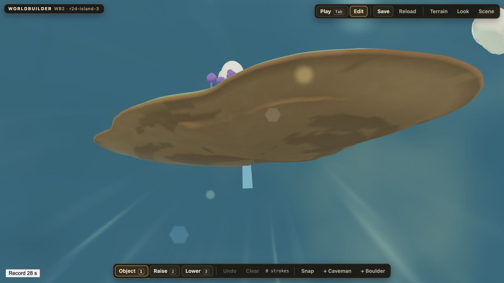
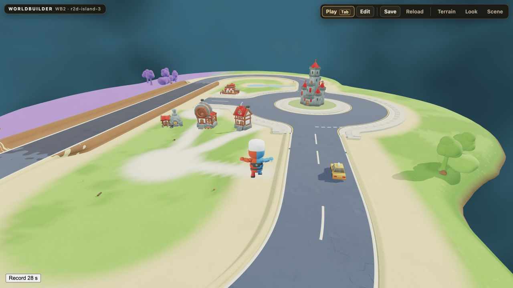
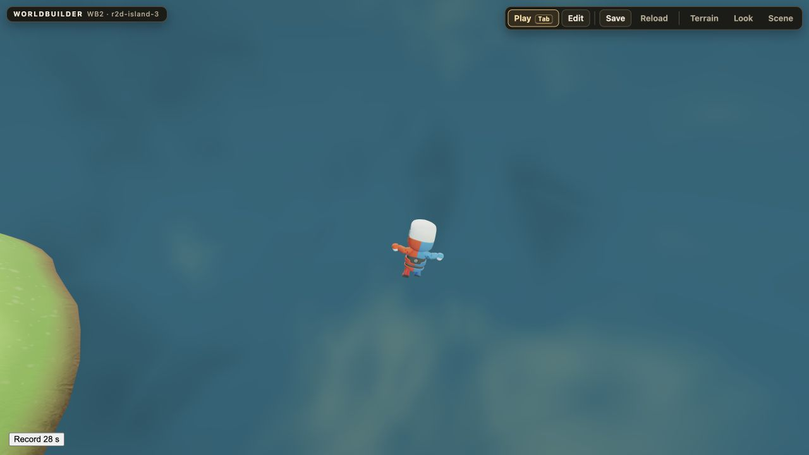
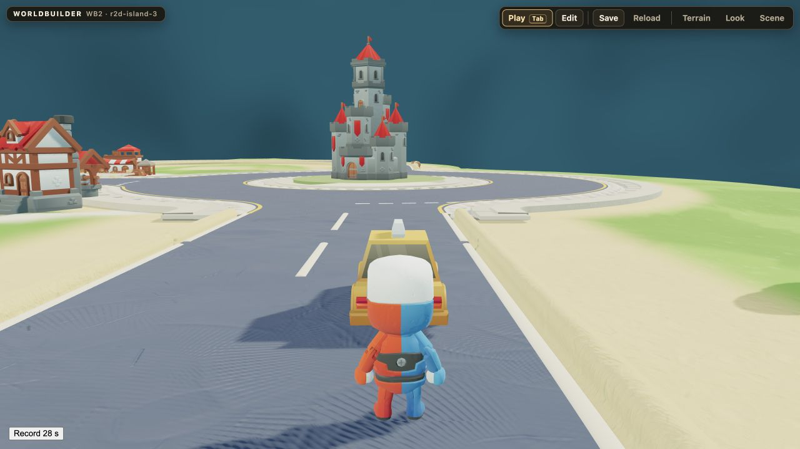

# R4 FAIL Return · 2026-10-08

**NO MVP · PROVEN OUTCOME BLOCKER · WORLD_MODEL / COMPOSITION_SYNTHESIS_FAILURE**

**F-R39 = FAIL · NO GOLDEN BASELINE · STOPPED BY USER.** Kein repaired One-Shot. Keine weitere Geometrie, Assetaufnahme, Systemintegration oder neue Spezifikationsschicht. Kein Merge, keine Site-Veröffentlichung, kein Live. Dies ist ein Sicherungs-Return, keine Aufforderung zur Wiederaufnahme.

Owner WB2 · Repo georg-doc/kayfabizarro · Draft PR #348 · Branch chatgpt-web/wb2-convergence-golden-corridor-01-2026-10-04.
Letzter implementierter GitHub-Head: `e31005f5cca79d675d717709a38af63aaaf339e1`. Der enthaltende Sicherungscommit identifiziert diesen Return und die archivierten lokalen Zwischenstände. Die lokalen, von Georg ebenfalls kommentierten Ansichten hatten keinen eindeutigen Git-Head; sie werden nicht rückwirkend als exakt e310 ausgegeben.

## Tatsächlicher FAIL und Belege

1. Formal gebauter, semantisch unbegründeter Loop/Null-Track mit Sackgassenast: Georgs sichtbarer Befund. Die technische geschlossene Traversal bei 9bc11ba widerlegt nicht das fehlende Ziel des Straßennetzes. Siehe Critic-Aufnahmen 08, 12, 13 und `island-road-recipe.v1.mjs` bei e310. Lokale vierarmige Anschlussreparatur nur im Archiv, ohne erneute Abnahme.
2. Fehlende kausale Stadt-/Markt-/Alltagsstruktur: Aufnahmen 07, 08, 12, 13 zeigen Verkehrsdominanz, kleine isolierte Siedlung und weitgehend leere Flächen. Critic meldet Komposition 6.5/10 und P1; Georg präzisiert den grundlegenden World-Model-Fehler. Kein animierter Einzel-NPC könnte diese räumliche Ursache nachträglich beweisen.
3. Falsche mittelalterliche KayKit-Familie statt vorgesehener Joyride-Town-Designsprache: Aufnahmen 01, 03, 07, 08; `VISIBLE_SOURCE_MANIFEST.json` und `r2d-presentation.v1.js` bei e310. Die positive isolierte Castle-Identitätsbewertung des Critics beweist Wiederverwendung, aber keine passende Town-Auswahl. Das ursprüngliche Critic-Dokument bleibt unverändert, seine Auswahlbewertung wird durch Georgs Produktentscheidung überstimmt.
4. Legacy `theatre-curtain-v1`: `wb2-mvp.v1.js` bei e310 Zeile 13 importiert `../../_inbox/KFB Theatre Curtain v2/2026-09-24-theatre-curtain/game-ready/theatre-curtain-v1/runtime/kfb-theatre-curtain.mjs`; prepareIntro nutzt ihn. Georg-PASS Recovery r3 liegt bei `7ca4a36bfeae16dfbc0e0ba99427a4da1b1c2d3e`, Core-Blob `87d44e2cafa85e92abc3bc6ed4ef554910d45693`, Issue #372. Der lokale Intake/Adapter ist archiviert, nicht angenommen: bestehender r160-WebGL-Host und r186-WebGPU-Donor sind nicht integriert bewiesen. Kein Curtain-Screenshot oder r3-Runtime-PASS wird behauptet.

Eigene Critic-Aufnahmen, Report und rohe DOM-Belege: [phase3-critic](evidence/r4-fail-2026-10-08/phase3-critic/REPORT.md). Kein kontinuierlicher Critic-Clip vorhanden; kein vollständiges F-R39-Abnahmepaket. Die vorhandenen negativen Belege genügen zur Ablehnung, nicht zur Annahme.

## Technisch salvageable, jeweils begrenzter Beweis

| Baustein | Exakter Commit | Beweis / Grenze |
|---|---|---|
| Stabile benannte Inseldokumente, gleicher Seed ohne Identitätsvermischung | e6ac9abf47ac0109d9d516bc129e6df8539fbc66 | evidence/r4-foundation/island-a-b-a.json; kein Gesamtprodukt-PASS |
| Authoring-/Sculpt-Replay, frischer Import, Rollback bei ungültigem Import; gemeinsame sichtbare/physische Oberfläche | 472ecc06915923a0c81d8252435d0128e8c0910c | evidence/r4-foundation/object-fresh-and-import-rollback.json, surface-witness-sculpt.json, normal-input-barrier-contact.json; vollständiger späterer Produkt-Roundtrip bleibt offen |
| Ground und vorhandener Travel-Flight-Owner, normale Eingaben und Mode-Handoffs | ea50b450748f3c0edc2f8aa12059b7e34c0cb9ce | evidence/r4-player/normal-input-ground.json, ground-flight-ground.json; Höhencap/Lesbarkeit vom Critic beanstandet, 0.30m Autostep bekannter TODO |
| Joyride Drive mit gemeinsamem Rapier-Kollisionsproxy und Übergaben | 8f3a78c6a074e7cbf3c904a4845c3db6003db671 | evidence/r4-player/drive-normal-input.json, drive-final-handoff.json; kein kontinuierlicher Rotations-Sweep behauptet |
| Track-Core-Graph, native Sockets und geschlossene technische Traversal; Joyride-Straßenquellen isoliert | 9bc11ba0861ac5b41f8a4df3d76922bac1e23134 | evidence/r4-roads/normal-input-loop.json, source-provenance.json, source-joyride-j14-street.jpg und curve.jpg; Mechanik brauchbar, Insel-Route verworfen |
| Instanzierter Kontakt, Surface-Abgleich und einzelne Source-Presentation-Adapter | e31005f5cca79d675d717709a38af63aaaf339e1 | evidence/r4-golden/surface-current-technical.json, exact-road-ray-seam.json, native-tests.txt; 517 Stichproben, max. Physikdelta ca. 1.42e-6m; keine automatische Material-/Kompositionsfreigabe |

Vorhandene Tests am e310: 25 PASS, ein bekannter quarantinierter TODO. Lokale spätere Testausgaben sind separat archiviert und belegen keine angenommene neue Szene. Keine neuen Runtime-Tests oder Reparaturen für diesen Sicherungs-Return durchgeführt. Alle REQUIRED-Zeilen bleiben NOT_GREEN/UNKNOWN/FAIL, soweit keine vollständige Abnahme vorliegt; technische Teilbelege werden nicht hochgestuft.

## Verworfen / erhaltene Zwischenarbeit

Als Inselentwurf verworfen: straßengetriebene Gesamtform, bedeutungsloser Loop mit Restflächenbesiedlung, Medieval-Town/Castle-Auswahl als Ersatz für Joyride-Town, nachträglich dekorierte Nature-Zone und Legacy-Curtain als Übergangslösung. Kein Bestandsschutz für diese Komposition.

Nicht gelöscht: alle genannten Commits und ihre Evidence. [Archivmanifest](evidence/r4-fail-2026-10-08/working-state-files.json) nennt jeden nach e310 lokal geänderten/neuen tools-Pfad samt SHA256. [Arbeitsarchiv](evidence/r4-fail-2026-10-08/unaccepted-working-state.tar.gz) bewahrt exakte Dateien, einschließlich unfertiger Compact-Junction-, Joyride-Town- und Approved-Curtain-Versuche. [Patch](evidence/r4-fail-2026-10-08/unaccepted-tracked-changes.patch) dokumentiert getrackte Änderungen. Archiv ist keine neue Runtimeversion, kein Donor-PASS und kein Reparaturauftrag. Die ausführliche Story-Hypothese ist zurückgenommen; nur kurze Recovery-Notiz bleibt aktiv.

## Kleinster nächster Design-Gate, noch nicht beauftragt

Eine einzige quellenbasierte 2D-Kompositionsskizze mit vorhandenen Quellenansichten: Inselgrund/Funktion und Vergangenheit, zwei bis drei konkrete Bewohner mit Tätigkeitsorten, Markt/Bühne/Turm, Ankunft und weiterführende Inseltracks. Jede Verbindung muss durch Gebrauch begründet sein. Ein unvoreingenommener Betrachter beschreibt daraus ohne Begleitgeschichte, wozu der Ort dient und wie sein Alltag funktioniert. Georg entscheidet PASS/FAIL über diese räumliche Idee. Erst ein neuer ausdrücklicher Auftrag nach diesem Gate erlaubt wieder Geometrie. Kein neuer Systemvertrag und kein automatisch gestarteter Ersatz-One-Shot.

## Vollständige REQUIRED-Tabelle · operationalVersion 5

Status bezeichnet Produktabnahme, nicht Teiltest. Alle 44 Zeilen erhalten; 13 STRONGLY INCLUDE und 7 OPTIONAL PROOF bleiben im unveränderten gefrorenen Vertrag. F-R07 ohne Georgs Lauf UNKNOWN.

| ID | Status | Evidence/Proof | Blocker/Unresolved Note |
|---|---|---|---|
| F-R01 | NOT_GREEN | evidence/r4-foundation/object-fresh-and-import-rollback.json; evidence/r4-foundation/surface-witness-sculpt.json; evidence/r4-foundation/normal-input-barrier-contact.json | Foundation implementation/probes complete for progression; final required subsystem/whole-product critic and actual complete island acceptance still pending. |
| F-R02 | NOT_GREEN | evidence/r4-foundation/object-fresh-and-import-rollback.json; evidence/r4-foundation/surface-witness-sculpt.json; evidence/r4-foundation/normal-input-barrier-contact.json | Foundation implementation/probes complete for progression; final required subsystem/whole-product critic and actual complete island acceptance still pending. |
| F-R03 | NOT_GREEN | evidence/r4-foundation/object-fresh-and-import-rollback.json; evidence/r4-foundation/surface-witness-sculpt.json; evidence/r4-foundation/normal-input-barrier-contact.json | Foundation implementation/probes complete for progression; final required subsystem/whole-product critic and actual complete island acceptance still pending. |
| F-R04 | NOT_GREEN | evidence/r4-foundation/object-fresh-and-import-rollback.json; evidence/r4-foundation/surface-witness-sculpt.json; evidence/r4-foundation/normal-input-barrier-contact.json | Foundation implementation/probes complete for progression; final required subsystem/whole-product critic and actual complete island acceptance still pending. |
| F-R05 | NOT_GREEN | evidence/r4-foundation/object-fresh-and-import-rollback.json; evidence/r4-foundation/surface-witness-sculpt.json; evidence/r4-foundation/normal-input-barrier-contact.json | Foundation implementation/probes complete for progression; final required subsystem/whole-product critic and actual complete island acceptance still pending. |
| F-R06 | NOT_GREEN | evidence/r4-foundation/object-fresh-and-import-rollback.json; evidence/r4-foundation/surface-witness-sculpt.json; evidence/r4-foundation/normal-input-barrier-contact.json | Foundation implementation/probes complete for progression; final required subsystem/whole-product critic and actual complete island acceptance still pending. |
| F-R07 | UNKNOWN | Kein vollständiger Abnahmebeleg | WSA instruments the actual integrated product for the Ground→Drive→Flight performance route; Georg runs it once on GEORG_PRIMARY_ACCEPTANCE_MACHINE in a visible focused browser with no meaningful parallel GPU load. Persist run metadata and performance JSON against the exact candidate head before applying LOD/instancing/terrain-Clay optimizations. |
| F-R08 | NOT_GREEN | Kein vollständiger Abnahmebeleg | Keep all required boot, movement, Residents' routine/activity and world reactions deterministic without mandatory LLM latency. |
| F-R09 | NOT_GREEN | Kein vollständiger Abnahmebeleg | Reconcile current Ground consumer to binding controls without second listeners/writers. |
| F-R10 | NOT_GREEN | Kein vollständiger Abnahmebeleg | Tune consumer speeds/playback from measured clips so default is Jog, Shift is faster Sprint, slow walk is deliberate, Backward is useful and stride-matched. |
| F-R11 | NOT_GREEN | Kein vollständiger Abnahmebeleg | Bind Jump_Start take-off to actual impulse, ballistic air to real trajectory, Jump_Land to actual support contact; add readable cartoon anticipation/compression. |
| F-R12 | NOT_GREEN | Kein vollständiger Abnahmebeleg | Repair camera against current simple island Ground/Drive/Flight routes before reintroducing extreme spiral geometry. |
| F-R13 | NOT_GREEN | Kein vollständiger Abnahmebeleg | Reuse Travel flight physics/camera and accepted double-Space intent; mount same avatar/equipment presentation without second Flight solver. |
| F-R14 | NOT_GREEN | Kein vollständiger Abnahmebeleg | Unify explicit ownership tokens/handoffs for Ground, Drive, Flight, Dialogue and Activity using existing mode bridges. |
| F-R15 | NOT_GREEN | Kein vollständiger Abnahmebeleg | Route ordinary road and race/fun section through Track Core profiles/sockets/contact, with Joyride visible adapter and Surface reconciliation. |
| F-R16 | NOT_GREEN | Kein vollständiger Abnahmebeleg | Build one simple island loop with POI/village street or sidewalk, bridge/water crossing and modest race/fun segment. Use a cleanly compiled Track-Core-supported junction/roundabout. Lab evidence says some 60° STANDARD-arm roundabouts refuse, T-junction is missing in v0.12, and plate fallback is defective; avoid rediscovery and resolve any genuinely required missing primitive in the Track Core owner. |
| F-R17 | NOT_GREEN | Kein vollständiger Abnahmebeleg | Integrate current Drive on authored route; repair steering/collision/recovery only to the level needed for stable normal traversal. |
| F-R18 | NOT_GREEN | Kein vollständiger Abnahmebeleg | Preserve avatar/world pose, heading and safe support across Ground↔Drive and Ground↔Flight handoffs. |
| F-R19 | NOT_GREEN | Kein vollständiger Abnahmebeleg | Apply K1/H0 Golden + K2/v10 routing per asset family with distance-scaled treatment and correct shadow/contact. |
| F-R20 | NOT_GREEN | Kein vollständiger Abnahmebeleg | Apply Claybound compatibility review to every new/adapted custom family before integration. |
| F-R21 | NOT_GREEN | Kein vollständiger Abnahmebeleg | Require original source-family isolation before visual adaptation and integration; retain source IDs/pins. |
| F-R22 | NOT_GREEN | Kein vollständiger Abnahmebeleg | Compose sparse/medium authored clusters and landmarks using hierarchy/negative space instead of uniform procedural scatter. |
| F-R23 | NOT_GREEN | Kein vollständiger Abnahmebeleg | Combine physical snap with local transition treatment: terrain/vegetation/material overlap, root/rock support and authored clusters. |
| F-R24 | NOT_GREEN | Kein vollständiger Abnahmebeleg | Consume one existing Environment owner and align island lighting/atmosphere/cloud presentation with KFB/Claybound look. |
| F-R25 | NOT_GREEN | Kein vollständiger Abnahmebeleg | Choose one strong source-proven landmark family and integrate it through Claybound/source-isolation/grounding gates. |
| F-R26 | NOT_GREEN | Kein vollständiger Abnahmebeleg | Implement one representative coherent water/river/coast/edge seam owned by Surface Truth and current visual presentation. |
| F-R27 | NOT_GREEN | Kein vollständiger Abnahmebeleg | Expose PLAY/BUILD/GOD in same runtime and preserve mode handoff without second editor. |
| F-R28 | NOT_GREEN | Kein vollständiger Abnahmebeleg | Require source-isolated asset selection and real PLACE/MOVE/ROTATE/SCALE/SNAP through existing editor. |
| F-R29 | NOT_GREEN | Kein vollständiger Abnahmebeleg | Serialize native ordered raise/lower strokes with validation and freeze the authoritative evaluation order relative to river/village and Track road-fit contributions. Reconcile the current base→river/village→road-fit→sculpt receiving sequence with Track design that excludes sculpt before claiming exact replay. |
| F-R30 | NOT_GREEN | Kein vollständiger Abnahmebeleg | Persist Base Recipe, Canon/Authoring Override, Dynamic State and Player Overlay as distinct layers keyed by stable identity. |
| F-R31 | NOT_GREEN | Kein vollständiger Abnahmebeleg | Save complete pinned island document/RouteRecipe/sculpt/object/state; include the frozen terrain evaluation order/invalidation policy; fully unload; fresh import/reload and replay. |
| F-R32 | NOT_GREEN | Kein vollständiger Abnahmebeleg | Integrate two real source-proven 3D Residents into one POI/activity/reaction loop using current state/POI semantics. |
| F-R33 | NOT_GREEN | Kein vollständiger Abnahmebeleg | Consume real 3D Residents/Card context and current ChatterBox kernel; close EyeRig/PetMouth/real-Card and presentation fallback gaps. |
| F-R34 | NOT_GREEN | Kein vollständiger Abnahmebeleg | Integrate one canonical Card acquire/inspect/provenance record and Almanac representation into island context/persistence. |
| F-R35 | NOT_GREEN | Kein vollständiger Abnahmebeleg | Wire actual Billboard compositor/scheduler to real read-along/HyperNormalisation content loop in-world. |
| F-R36 | NOT_GREEN | Kein vollständiger Abnahmebeleg | Select a bounded mapped/context-compatible subset from the researched pool and feed quote IDs/provenance/rights/FrizzleQuestion/Brain-Food to consumer. |
| F-R37 | NOT_GREEN | Kein vollständiger Abnahmebeleg | Inject existing AudioContext/SCORE destination and send only serialized world context/events to Audio module. |
| F-R38 | NOT_GREEN | Kein vollständiger Abnahmebeleg | Integrate signature/transition seam and attach accepted Curtain module compatibly; apply Claybound/KFB visual tune without replacing cloth kernel. |
| F-R39 | FAIL | ISLAND_STORY_LAW_2026-10-08.md | F-R39 FAIL; NO GOLDEN BASELINE; WORLD_MODEL / COMPOSITION_SYNTHESIS_FAILURE; user stopped R4. |
| F-R40 | NOT_GREEN | Kein vollständiger Abnahmebeleg | Encode known failure classes into rubric and compare candidate against negative Goldens. |
| F-R41 | NOT_GREEN | Kein vollständiger Abnahmebeleg | Enforce real owner/real content at each integration row. |
| F-R42 | NOT_GREEN | Kein vollständiger Abnahmebeleg | Run read-only critics on required subsystems after integrated implementation, using actual app, normal inputs and critic-owned evidence. |
| F-R43 | NOT_GREEN | Kein vollständiger Abnahmebeleg | Drive one continuous product route through movement, Drive, Flight, living/media, authoring, save/unload/fresh reload and return to Play. |
| F-R44 | NOT_GREEN | Kein vollständiger Abnahmebeleg | Aggregate only actual accepted proofs from F-R01–F-R43; no row may be inferred green. Final Return must include the complete 44-row REQUIRED table whether PASS or NO MVP. |
